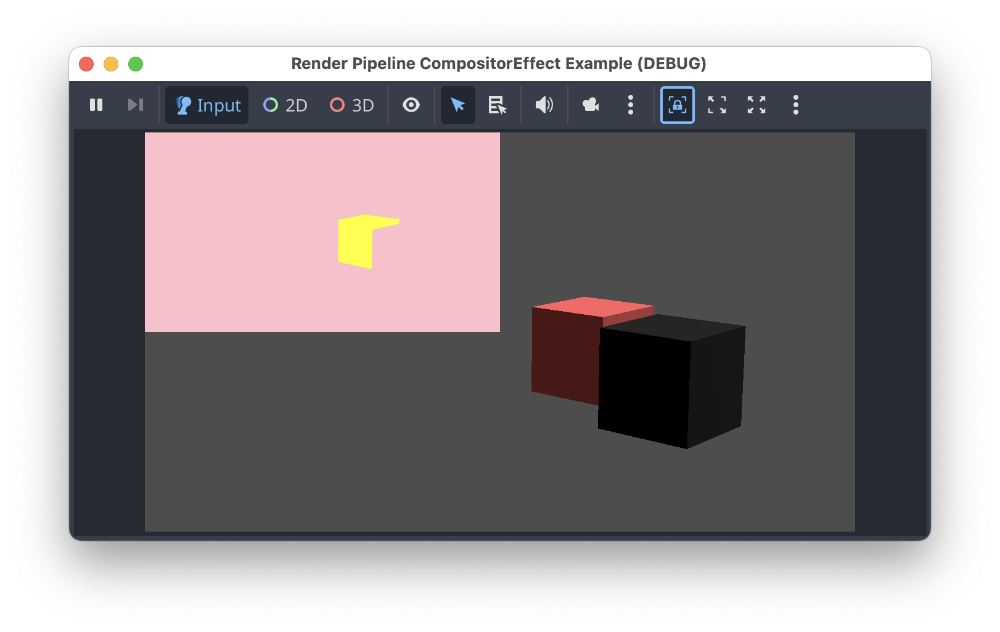

# Godot v4.5 CompositorEffect demo using render pipeline, and stencil buffer

This project is a small demonstration of using the stencil buffer in
a CompositorEffect using a render pipeline.  The demo scene renders
stencil values equal to 1 as yellow in the TextureRect shown in the
top-left corner of the screen.

This project has been tested on Godot 4.5-rc2.

## Scene Breakdown
The main scene of the project is `node_3d.tscn`.  It contains two MeshInstance3Ds, one of them `StencilMaterialBox` has a StandardMaterial3D that writes `1` to the stencil buffer.  The other MeshInstance3D, `Box`, has an albedo-only material.

The `StencilMaterialBox` has the following Stencil settings in its StandardMaterial3D:

The Camera3D in the scene has a compositor set, and only one effect, `RenderPipelineCompositorEffect`.  That effect runs on the Post-Opaque pass, and it has an export variable containing the resource path to the [shader code](render_shader.glsl).

Finally there is a `TextureRect` that will display the results of the `RenderPipelineCompositorEffect`.

The [node script](node_3d.gd) configures the `TextureRect` to use the ouptut_texture of `RenderPipelineCompositorEffect`.  It also monitors the shader source file for changes, to notify the compositor effect that it needs to rebuild the render pipeline.

## `RenderPipelineCompositorEffect`
The [`RenderPipelineCompositorEffect`](./render_pipeline_compositor_effect.gd) is responsible for creating & updating the dedicated render pipeline that updates an output texture based on the contents of the stencil buffer.  A large part of the complexity in that file comes from the need to keep the resoultion of the output texture the same as the viewport's resolution.  We have to dynamically create the output texture, and rebuild framebuffers, and the render pipeline as the viewport changes.
